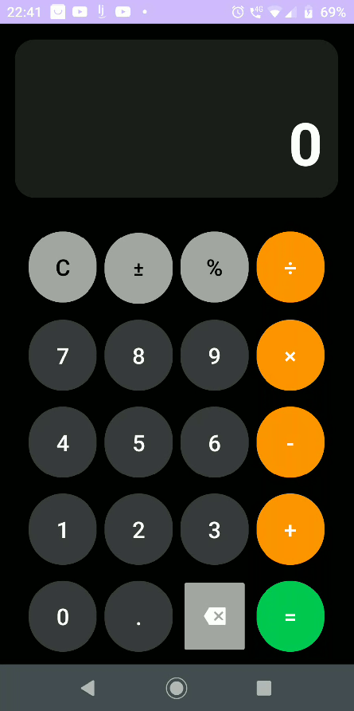

# 🧮 Calculator

**Calculator** is a simple calculator app designed to demonstrate **layout creation in XML**, implemented with **Kotlin** and built in **Android Studio**. The app focuses on a clean interface and intuitive user experience.

---

## ✨ Features

- 🔢 **Number Input:** Tap digits to enter numbers.  
- ➕➖✖️➗ **Operations:** Addition, subtraction, multiplication, division.  
- 🟰 **Result Display:** Calculate results instantly with `=`.  
- 🔄 **Sign Toggle:** Change between positive and negative values.  
- 💯 **Percentage Function:** Convert numbers to percentages.  
- 🧹 **Clear & Backspace:** Reset input or remove the last digit.  
- 🌑 **Dark Theme:** Elegant, modern dark interface with color-coded buttons.  

---
